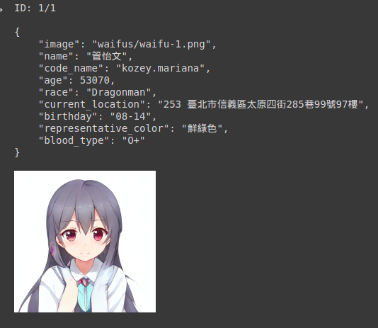
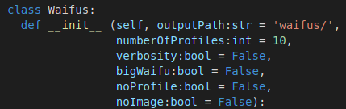

# aWaifu-Colab
Mass scale anime waifu profile generator, run in Google Colab

## Examples

<br>

Examples of generated results are placed in the above `examples` folder. At default configuration (like in the examples), it takes about 10 secs each 10 pics.

# Installation
You just need that `aWaifu.ipynb` file, nothing more. Upload it to your [Google Colab](https://colab.research.google.com/), and you are ready to go.

## Basic Usage
For those who just want to try it out, there are 3 switched right at the top of the script.
```python
# Turn these on if you are too lazy to read the code
autoRun = False
autoSave = False
verbose = False
```
Ctrl+F9 to run all cells. As fast, as easy as possible.<br>

## Not-so-basic Usage
For those who want to dig in, first create an `Waifus` object:
```python
waifuGen = Waifus(outputPath:str, numberOfProfiles:int, verbosity:bool, bigWaifu:bool, noProfile:bool, noImage:bool)
```
<br>

Here are the default arguments' values:


<br>

So there should be no problem if you define it with:
```python
waifuGen = Waifus()
```
<br>

In short, here is the fundamental workflow:
```python
waifuGen = Waifus(*whatever_option_you_want_here*) # configuring
waifuGen.generateProfiles() # Generating
waifuGen.getAllInfo() # Downloading
```
<br>

A list of available methods and their accepted arguments:
```python
Waifus.cleanUpPreviousRuns() -> None # Delete data from previous executions
Waifus.showWaifuImages() -> None     # Display all suitable images from 'waifus/' directory
Waifus.getAllInfo() -> None          # Download 'waifus/' directory under zip format
Waifus.getRandomAge() -> None        # Randomly generate an age
Waifus.getRandomRace(age:int) -> str # Randomly choose a race based on age

Waifus._vbose(contextType:str, context) -> None        # Verbose logging 'context', based on its defined 'contextType'
Waifus._getRandomProfile(imagePath:str) -> 'json data' # Randomly generate a female profile
Waifus._getRandomImages(filename:str) -> None          # Randomly generate a waifu image

Waifus.generateProfiles() -> None # Generate waifu images and profile
```
<br>

Not a lot of function, but to save your precious time, in short, you just need `Waifus.generateProfiles()`.
<br>

## Tech Stack
Ain't much. It uses [Python WaifuLabs wrapper](https://github.com/Taromaruu/WaifuLabs) as well as [Name Fake API](https://namefake.com/api) - free to use and no token needed.

## Faster execution time

<br>

In my opinion, approximately 1 profile/sec is a pretty decent speed. But if you still want to go faster, you can look for a `sleep` statement in the code, and remove it. However, this is not recommended.

## Development
Feel free to contribute, either by more codes or reporting issues. I know my code is not-very-readable,...


<br>

... but any help would be very appreciated.
